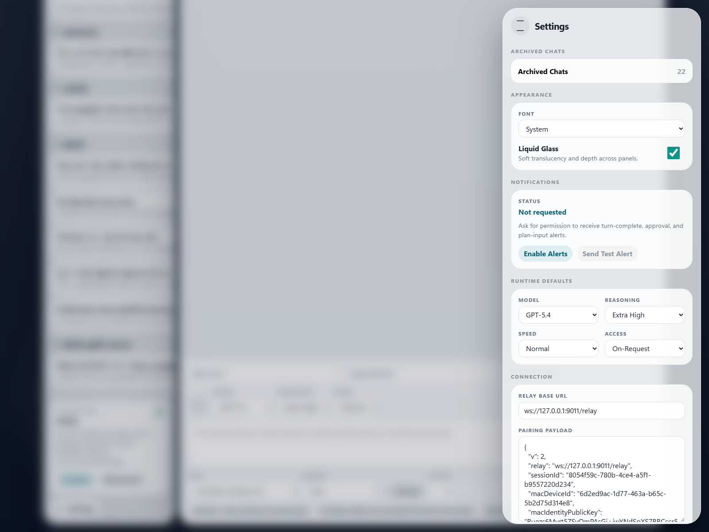
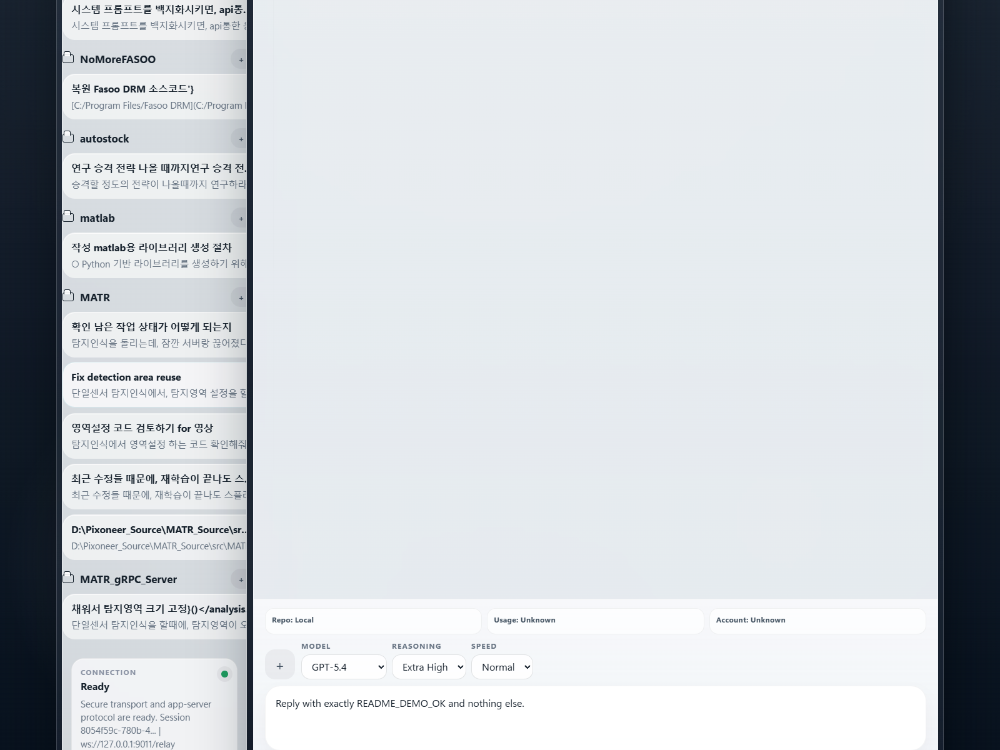
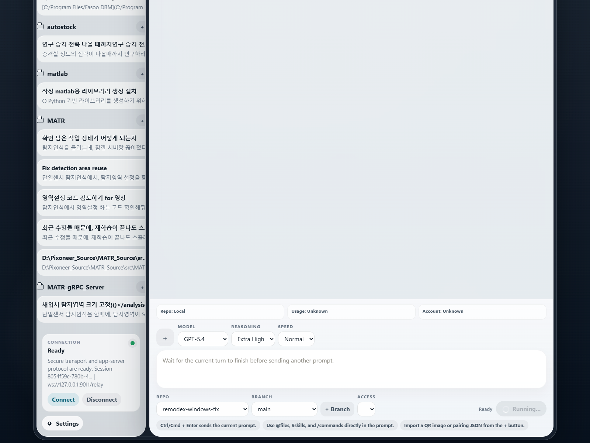
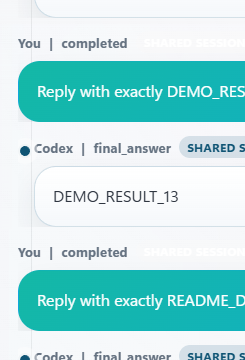
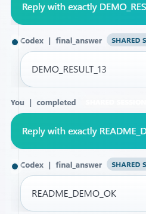

# remodex-windows-fix

Windows에서 `remodex up` 실행 시 `spawn codex ENOENT`로 죽는 문제를 막기 위해 만든 Remodex 호환 포크입니다.

핵심은 단순합니다.

- Windows에서 `codex.cmd` / `codex.bat` / `codex.exe`를 안전하게 찾아서 실행합니다.
- 로컬 relay, pairing QR/JSON, browser client(`/app/`) 흐름을 그대로 유지합니다.
- `codex app-server`와 실제로 붙여서 원격 요청을 보내고 응답을 받을 수 있습니다.

## 실제 운용 캡처

아래 이미지는 `2026-04-06` 기준 실제 로컬 실행 화면입니다.

- relay를 백그라운드에서 실행
- bridge를 `codex app-server`에 연결
- browser client를 `/app/`으로 접속
- pairing JSON을 로드
- 실제 요청 전송
- 실제 응답 수신

실제 데모에서 사용한 요청:

```text
Reply with exactly README_DEMO_OK and nothing else.
```

실제 데모에서 받은 응답:

```text
README_DEMO_OK
```

### 1. Pairing JSON이 로드된 상태

<p align="center">
  
</p>

이 단계에서 확인할 것:

- `Relay Base URL`이 맞는지
- `Pairing Payload`가 들어왔는지
- `sessionId`와 `macDeviceId`가 채워졌는지

### 2. 연결 완료 후 프롬프트를 입력하는 화면

<p align="center">
  
</p>

이 단계에서 할 일:

- 좌측 하단 `Connection` 상태가 `Ready`인지 확인
- 프롬프트를 작성
- `Send` 클릭

### 3. 실제 turn이 올라간 상태

<p align="center">
  
</p>

이 화면에서는:

- 좌측 하단 연결 카드가 `Running turn`
- 우측 하단 버튼 상태도 `Running...`
- bridge가 이미 실제 요청을 Codex 쪽으로 전달한 상태

### 4. 메시지 영역만 잘라서 본 요청/응답 흐름

<table>
  <tr>
    <td align="center">
      
    </td>
    <td align="center">
      
    </td>
  </tr>
  <tr>
    <td align="center"><strong>요청이 thread에 들어간 직후</strong></td>
    <td align="center"><strong>최종 응답 수신 완료</strong></td>
  </tr>
</table>

왼쪽은 실제 요청이 thread에 append된 상태이고, 오른쪽은 실제 응답 `README_DEMO_OK`가 도착한 상태입니다.

## 빠른 시작

### 1. 설치

```bash
npm install -g remodex-windows-fix
```

CLI 명령:

```bash
remodex-windows-fix
```

iPhone 앱은 App Store에서 받을 수 있습니다.

- [Remodex Remote AI Coding](https://apps.apple.com/us/app/remodex-remote-ai-coding/id6760243963)

### 2. 가장 빠른 로컬 실행

터미널 A:

```bash
npm run relay
```

터미널 B:

```powershell
$env:REMODEX_RELAY = "ws://127.0.0.1:9000/relay"
$env:REMODEX_REFRESH_ENABLED = "false"
remodex-windows-fix up
```

브라우저:

```text
http://127.0.0.1:9000/app/
```

포트 `9000`이 이미 사용 중이면 relay를 다른 포트로 띄우면 됩니다.

예:

```bash
remodex-relay 9011
```

그 다음:

- 브라우저에서 `/app/` 접속
- `Settings` 또는 `Scan QR`로 pairing 정보 로드
- `Connect`
- 기존 thread 선택 또는 `+ New Thread`
- 프롬프트 입력 후 `Send`

### 3. pairing 산출물 위치

bridge를 띄우면 기본적으로 아래 파일이 생성됩니다.

```text
%USERPROFILE%\.remodex\pairing-qr.png
%USERPROFILE%\.remodex\pairing-qr.json
```

QR 대신 JSON을 바로 브라우저에 넣어도 됩니다.

### 4. QR를 새로 강제로 띄우고 싶을 때

```bat
run-clean-qr.bat
```

이 스크립트는:

- 기존 bridge 정리
- pairing 상태 초기화
- 새 bridge 실행
- 새 QR PNG 자동 오픈

relay URL을 직접 넘길 수도 있습니다.

```bat
run-clean-qr.bat wss://YOUR-RELAY/relay
```

## 자주 쓰는 명령어

bridge 실행:

```bash
remodex-windows-fix up
```

pairing 초기화:

```bash
remodex-windows-fix reset-pairing
```

마지막 active thread 다시 열기:

```bash
remodex-windows-fix resume
```

rollout 보기:

```bash
remodex-windows-fix watch [threadId]
```

macOS 전용 service 명령:

```bash
remodex-windows-fix start
remodex-windows-fix restart
remodex-windows-fix stop
remodex-windows-fix status
```

## Windows에서 실제로 바뀐 점

- `codex` 호출 시 Windows shim(`.cmd`, `.bat`)을 우선 탐색
- wrapper script가 없으면 `codex.exe`로 fallback
- shell 지원으로 Windows spawn 실패를 회피
- launcher 실패를 즉시 crash로 끝내지 않고 Remodex 오류 흐름으로 전달

원하면 특정 Codex 바이너리를 강제로 지정할 수 있습니다.

```powershell
$env:REMODEX_CODEX_BIN = "C:\Users\YOUR_USER\AppData\Roaming\npm\codex.cmd"
```

레거시 별칭:

```powershell
$env:PHODEX_CODEX_BIN = "C:\Users\YOUR_USER\AppData\Roaming\npm\codex.cmd"
```

## Relay 선택지

### 로컬 relay

```bash
npm run relay
```

또는:

```bash
remodex-relay
```

Docker Compose:

```bash
docker compose up -d
```

### Cloudflare Workers

Cloudflare Worker relay도 같이 들어 있습니다.

- Worker 코드: [`cloudflare/worker.mjs`](./cloudflare/worker.mjs)
- 설정: [`wrangler.toml`](./wrangler.toml)

배포 후 bridge는 이렇게 붙이면 됩니다.

```powershell
$env:REMODEX_RELAY = "wss://YOUR-WORKER.YOUR-SUBDOMAIN.workers.dev/relay"
remodex-windows-fix up
```

health check:

```text
https://YOUR-WORKER.YOUR-SUBDOMAIN.workers.dev/health
```

### Render 등 일반 Node 서비스

```powershell
$env:REMODEX_RELAY = "wss://YOUR-SERVICE.onrender.com/relay"
remodex-windows-fix up
```

## 검증용 최소 체크

```bash
codex --version
codex app-server --help
remodex-windows-fix up
```

정상적인 Windows 실행이면 결국 `codex app-server`가 실제로 떠야 합니다.

## 프로젝트 구조

```text
bin/
cloudflare/
relay/
src/
web/
artifacts/readme-demo/screenshots/
compose.yaml
Dockerfile
package.json
wrangler.toml
```

## 요약

이 저장소는 Windows에서 Remodex bridge를 안정적으로 띄우는 포크이고, 지금 README는 기능 설명보다 실제 사용 흐름이 먼저 보이도록 정리되어 있습니다.

즉, 이 순서만 기억하면 됩니다.

1. relay 실행
2. bridge 실행
3. QR 또는 pairing JSON 로드
4. browser client 연결
5. thread 열기
6. 요청 전송
7. 응답 확인
